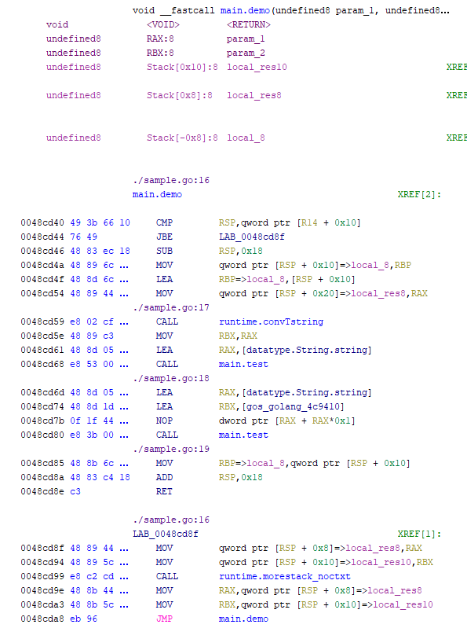

# GolangAnalyzerExtension
GolangAnalyzerExtension helps Ghidra parse Golang binaries.
It supports both 32bit and 64bit.

## Features
- Rename functions
- Modify function arguments
- Add source file and line number information to comments
- Add data type
- Search strings

## Usage
1. Download the release
2. Start Ghidra
3. `File -> Install Extensions... -> Add extension -> Select zip file`
4. Click the GolangAnalyzerExtension checkbox
5. Restart Ghidra
6. Analyze Golang binary
