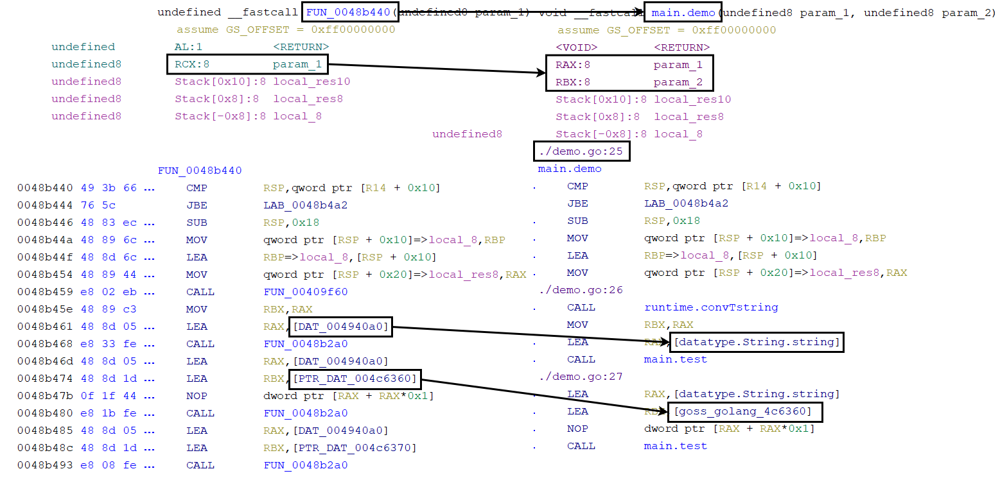

# GolangAnalyzerExtension
GolangAnalyzerExtension helps Ghidra analyze Golang binaries.
It supports go1.6 through go1.21.

## Features
This plugin for Ghidra provides the following functionality for analyzing Golang binaries:

- Detect the version of Golang
- Rename functions
- Correct function arguments
- Include source file and line number information in comments
- Add custom data types to Data Type Manager
- Search for strings within the binary

Please see the attached image.

## Usage
1. Download the release
2. Launch Ghidra
3. Navigate to `File -> Install Extensions... -> Add extension -> Select zip file`
4. Check the checkbox for `GolangAnalyzerExtension`
5. Restart Ghidra
6. Analyze your Golang binary
